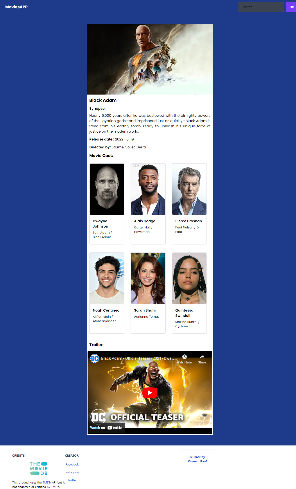

# MoviesAPP

<h2 align="center">MoviesAPP to getinformations about movies</h2>

### Demo Link: [MoviesApp](https://OssmanRauf.github.io/MoviesAPP/)

---

## Some screenshoot of the site in production

 

 

---

## Main functionalities of the application

- Search the lastest movies
- Read the sypnoses of the movies
- See the cast of the movies
- Watch the trailer

I'm using [TMdb api](https://developers.themoviedb.org/3/getting-started/introduction) for the movies information.

<h2>Built with</h2>

 

- React
- Axio
- tailwind
- React-router
